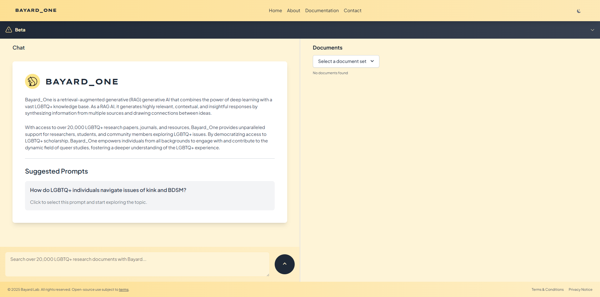
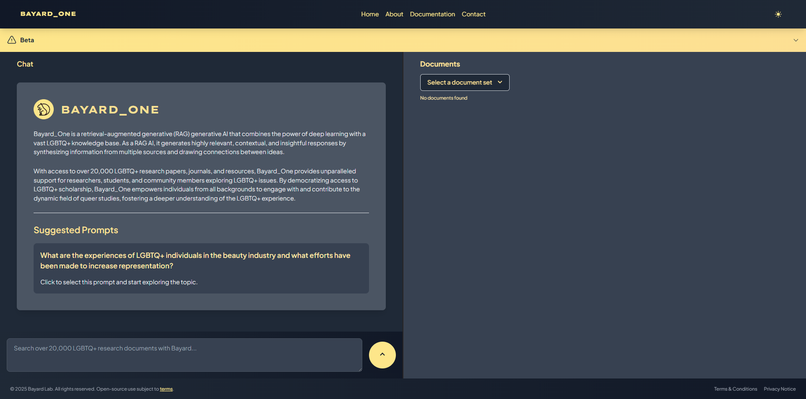

## **Features**

- Chat interface for querying the AI assistant
- Retrieval of relevant LGBTQ+ research documents
- Document summaries and abstracts
- Resizable panels for chat and document display
- Smooth animations and transitions
- Loading indicators and status updates
- Copy, share, and provide feedback on chat messages
- Regenerate responses
- Keyboard shortcuts for sending messages

## **Technologies Used**

- Next.js
- React
- TypeScript
- Tailwind CSS
- Radix UI components
- Framer Motion for animations
- React Spring for animations
- React Hot Toast for notifications
- Axios for API requests

## **Getting Started**

1. Clone the repository
2. Install dependencies: `npm install`
3. Set up environment variables: 
   - `BAYARD_API_KEY`: API key for the Bayard API
4. Run the development server: `npm run dev`
5. Open <http://localhost:3000> in your browser

## **Folder Structure**

- `app/`: Next.js app directory 
  - `page.tsx`: Main chat page component
- `components/`: Reusable UI components
- `pages/api/`: API routes 
  - `bayard-proxy.ts`: Proxy route for Bayard API requests
- `public/`: Public assets
- `styles/`: Global styles

